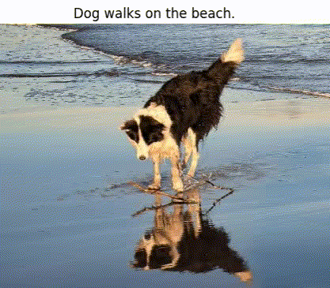

<h1> Image_Caption_Generator </h1>

This is a Deep Learning Model for generating captions for images. It uses techniques from Computer Vision and Natural Language Processing. Some examples of images from test dataset and the captions generated by the model are shown below.

  

<h3> TABLE OF CONTENTS </h3>
<ol>
    <li><a href="#intro"> Introduction </a></li>
    <li><a href="#dataset"> Dataset </a></li>
    <li><a href="#model"> Model </a> </li>
    <li><a href="#result"> Result </a> </li>
<!--     <li><a href="#examples"> Examples </a></li> -->
    <li><a href="#frameworks"> Frameworks, Libraries & Languages </a></li>
    <li><a href="#deployment"> Deployment </a></li>
    <li><a href="#demo"> Demo </a></li>
    <li><a href="#usage"> Usage </a></li>
    <li><a href="#acknowledgement"> Acknowledgement </a></li>
</ol>

<h2 id="intro"> Introduction </h2>

Deep Learning and Neural Networks have found profound applications in both NLP and Computer Vision. Before the Deep Learning era, statistical and Machine Learning techniques were commonly used for these tasks, especially in NLP. Neural Networks however have now proven to be powerful techniques, especially for more complex tasks. With the increase in size of available datasets and efficient computational tools, Deep Learning is being throughly researched on and applied in an increasing number of areas.
 
In 2012 the Google <a href="http://www.image-net.org/">ImageNet</a> Challenge (ILSVRC) results showed that Convolutional Neural Networks (CNNs) can be an excellent choice for tasks involving visual imagery. Being translation invariant, after learning a pattern in one region of an image, CNNs can very easily recognize it in another region - a task which was quite computationally inefficient in vanilla feed-forward networks. When many convolutional layers are stacked together, they can efficiently learn to recognize patterns in a hierarchical manner - the initial layers learn to detect edges, lines etc. while the later layers make  use of these to learn more complex features. In this project, we make use of a popular CNN architecture - the ResNet50 to process the input images and get the feature vectors.
 
For generating the captions, we make use of Long Short-Term Memory (LSTM) networks. LSTMs are a variant of Recurrent Neural Networks which are widely used in Natural Language Processing. Unlike a Dense layer, an RNN layer does not process an input in one go. Instead, it processes a sequence element-by-element, at each step incorporating new data with the information processed so far. This property of an RNN makes it a natural yet powerful architecture for processing sequential inputs.

<h2 id="dataset"> Dataset </h2>

This project uses the <a href="https://www.ijcai.org/Proceedings/15/Papers/593.pdf">Flickr 8K</a> dataset for training the model. This can be downloaded from <a href="https://www.kaggle.com/shadabhussain/flickr8k?select=model_weights.h5"> here</a>. It contains 8000 images, most of them featuring people and animals in a state of action.Though i have used two more dataset like [Flickr 30k](https://www.kaggle.com/datasets/adityajn105/flickr30k) and [Microsoft CoCo](https://www.kaggle.com/datasets/awsaf49/coco-2017-dataset) but flickr comparatively doing well.Here Each image is provided with five different captions describing the entities and events depicted in the image. Different captions of the same image tend to focus on different aspects of the scene, or use different linguistic constructions. This ensures that there is enough linguistic variety in the description of the images.

