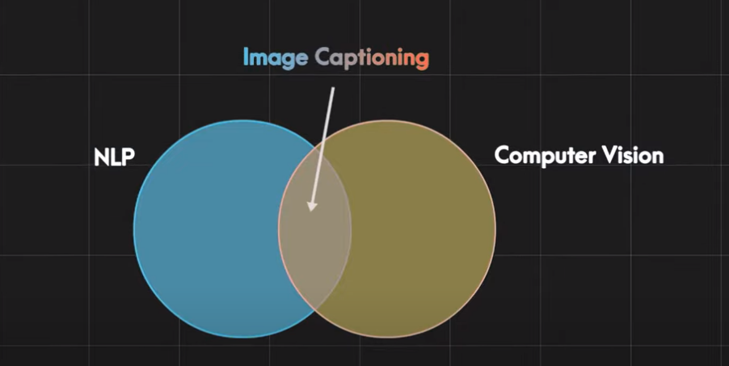
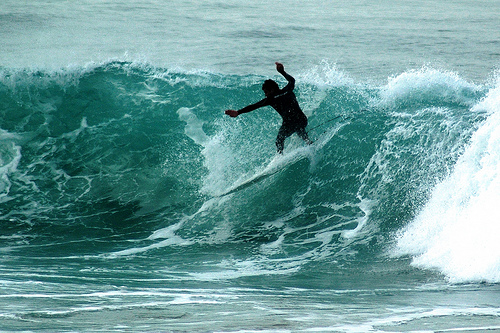
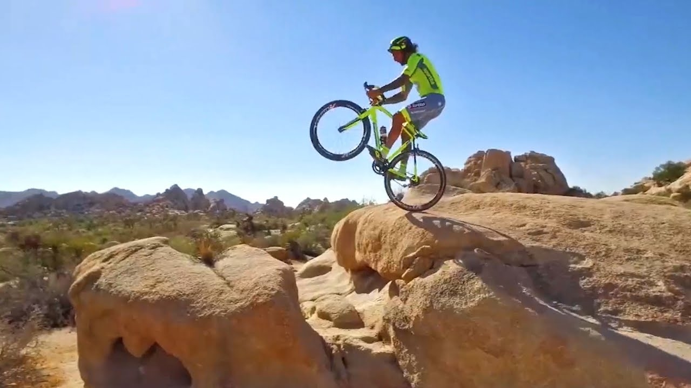
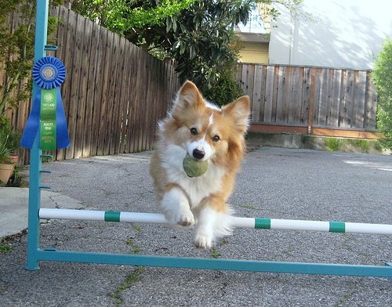
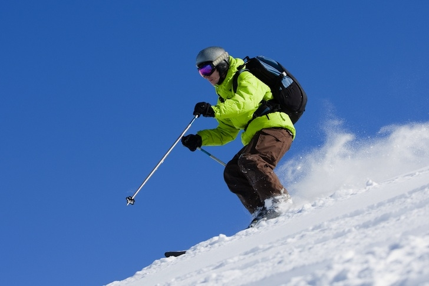
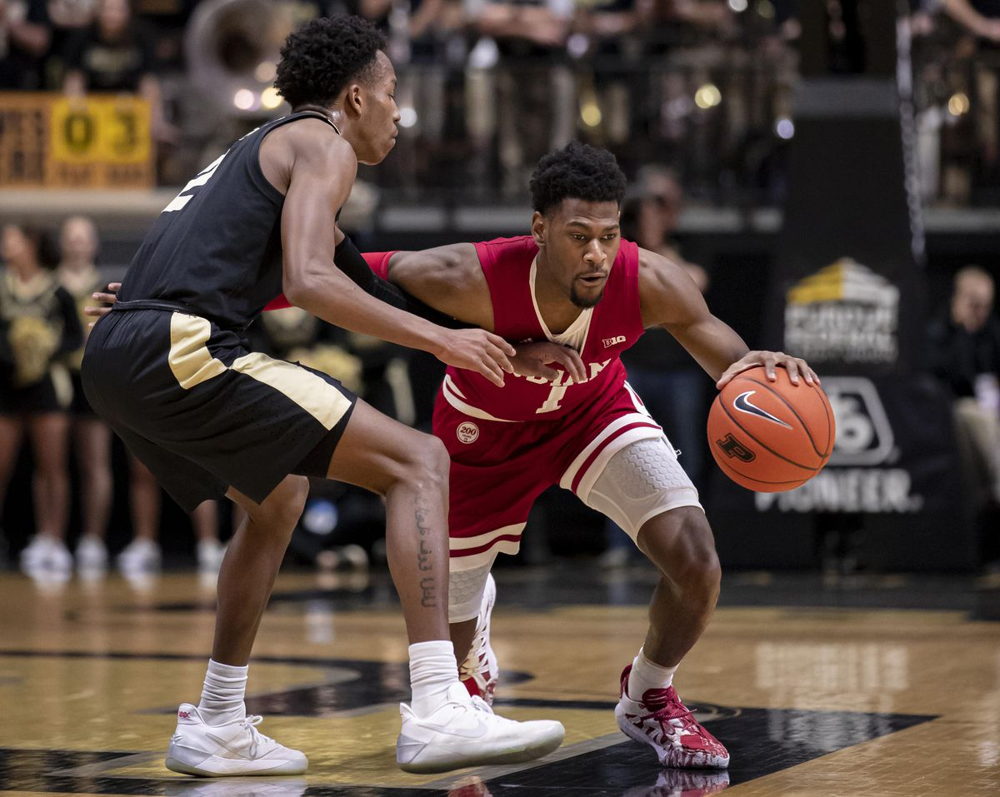

<p align="center">


<a href="https://www.linkedin.com/in/md-abdur-sobhan-riad-360b521b1/">
  
</a>
</p>

<h1> Image_Caption_Generator </h1>


<p align="justify">
This is a Deep Learning Model for generating captions for images. It uses techniques from Computer Vision and Natural Language Processing. Some examples of images from test dataset and the captions generated by the model are shown below.
</p>

<p align="center">
  
</p>


<h3> TABLE OF CONTENTS </h3>
<ol>
    <li><a href="#intro"> Introduction </a></li>
    <li><a href="#dataset"> Dataset </a></li>
    <li><a href="#model"> Used Model </a> </li>
    <li><a href="#performance"> Models performance </a> </li>
    <li><a href="#result"> Predicted Result </a> </li>
<!--     <li><a href="#examples"> Examples </a></li> -->
    <li><a href="#frameworks"> Frameworks, Libraries & Languages </a></li>
    <li><a href="#deployment"> Deployment </a></li>
    <li><a href="#demo"> Demo </a></li>
    <li><a href="#conclusion"> Conclusion </a></li>
    <li><a href="#acknowledgement"> Acknowledgement </a></li>
</ol>

<h2 id="intro">Introduction</h2>
<p align="justify">
Deep Learning and Neural Networks have found profound applications in both NLP and Computer Vision. Before the Deep Learning era, statistical and Machine Learning techniques were commonly used for these tasks, especially in NLP. Neural Networks however have now proven to be powerful techniques, especially for more complex tasks. With the increase in size of available datasets and efficient computational tools, Deep Learning is being throughly researched on and applied in an increasing number of areas.Image captioning is the process of taking an image and generating a caption that accurately describes the scene. This is a difficult task for neural networks because it requires understanding both natural language and computer vision. It is intersection between NLP and Computer Vision.
<p align="center">
<br><br>
</p>
<br>
<p>
The purpose of your image captioning project is to develop a system that can generate descriptive captions for images. The primary objective is to automate the process of generating accurate and meaningful textual descriptions that capture the visual content and context of the images.</p>
<p align="center">
  
</p>


<h2 id="dataset">Dataset</h2>

This project uses the ```Flickr 8K``` dataset for training the model. This can be downloaded from <a href="https://www.kaggle.com/shadabhussain/flickr8k?select=model_weights.h5"> here</a>. It contains 8000 images, most of them featuring people and animals in a state of action.Though i have used two more dataset like [Flickr 30k](https://www.kaggle.com/datasets/adityajn105/flickr30k) and [Microsoft CoCo](https://www.kaggle.com/datasets/awsaf49/coco-2017-dataset) but flickr 8k comparatively doing well from among datasets.Here Each image is provided with five different captions describing the entities and events depicted in the image. Different captions of the same image tend to focus on different aspects of the scene, or use different linguistic constructions. This ensures that there is enough linguistic variety in the description of the images.

</p>

<h2 id="model">Used Model</h2>

<p align="justify">
    In this project i used several models like vgg16 with lstm,resnet50 with lstm, inception v3 with lstm but considering everything i deployed vgg16 with lstm for my convenience the Vgg16 architecture for obtaining the image features. VGG networks, standing for Visual Geometry Group networks, have played a pivotal role in the realm of Computer Vision. Their significance was highlighted when they secured victory in the prestigious ImageNet Challenge. VGG networks demonstrated a groundbreaking concept—how even deep neural networks (VGG16 and VGG19 are examples) can be effectively trained, transcending the limitations of the vanishing gradient problem.

The hallmark of VGG networks is their simplicity and uniformity. Unlike the original ResNet with its 152 layers, VGG networks feature a straightforward and easily understandable architecture. This simplicity, combined with their effectiveness, makes them a popular choice for various computer vision tasks.

In the world of Transfer Learning, VGG networks shine brightly. Keras, a widely-used deep learning framework, includes pre-trained VGG models along with weights fine-tuned on the expansive ImageNet dataset. This availability has made VGG networks a go-to choice for researchers and practitioners in the field. Since we only need this network for getting the image feature vectors, so we remove the last layer. 
</p>

<div align="center">
  
</div>
<h2 id="performance">Models performance</h2>

Models | Accuracy | BLEU-1 | BLEU-1
--- | --- | --- | ---
Vgg 16 with Lstm | 0.5125 | 0.540437 | 0.316454
Resnet 50 with Lstm | 0.5522 | 0.538153 | 0.321559
InceptionV3 with Lstm | 0.5012 | 0.545291 | 0.323035

<h2 id="result">Predicted Result</h2>

Image | Caption 
--- | --- 
 | **Generated Caption:** Surfer rides the waves.
 | **Generated Caption:** Woman in green shirt and glasses is climbing large rock.
 | **Generated Caption:** Dog jumps over hurdle.
 | **Generated Caption:** Man in blue jacket snowboarding.
 | **Generated Caption:** Basketball player dribbles the ball.


<h2 id="frameworks">Frameworks, Libraries & Languages</h2>

<ul>
    <li> Keras </li>
    <li> Tensorflow </li>
    <li> Python3 </li>
    <li> Numpy </li>
    <li> Matplotlib </li>
    <li> pickle </li>
</ul>

<h2 id="deployment">Deployment</h2>

I made a web application using streamlit framework. This web application is hosted and deployed on two platforms: [HuggingFace Spaces](https://huggingface.co/spaces/MdRiad/Image_caption_generator) and [share.streamlit.io](https://imagecaptiongenerator-cjmnhj4scsrxheqxtsmune.streamlit.app/). The implementation can be found in ```app``` folder.


<h2 id="demo">Demo</h2>


This my web application demo. The application you can find [HuggingFace Spaces](https://huggingface.co/spaces/MdRiad/Image_caption_generator) and [share.streamlit.io](https://imagecaptiongenerator-cjmnhj4scsrxheqxtsmune.streamlit.app/).


https://github.com/riad5089/Image_Caption_Generator/assets/93583569/270f348f-404a-4823-b014-bed14be0d5b1

<h2 id="conclusion">Conclusion</h2>

This image caption generator application shows promise but currently faces challenges in generating accurate captions due to factors such as limited computational resources, a relatively small dataset, occasional GPU issues, and memory constraints. However, I am committed to making continuous improvements and enhancements to enhance its performance in the future. If you have any suggestions regarding this feel free to send me pull request.

<h2 id="acknowledgement">Acknowledgement</h2>

I referred many articles & research papers while working on this project. Some of them are listed below-
</p>
    <ul>
        <li> https://www.analyticsvidhya.com/blog/2021/12/step-by-step-guide-to-build-image-caption-generator-using-deep-learning/ </li>
      
  <li> https://data-flair.training/blogs/python-based-project-image-caption-generator-cnn/ </li>
  <li> https://towardsdatascience.com/understanding-and-coding-a-resnet-in-keras-446d7ff84d33 </li>
   <li> https://www.hackersrealm.net/post/image-caption-generator-using-python </li>
    </ul>


